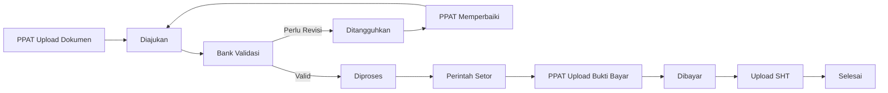
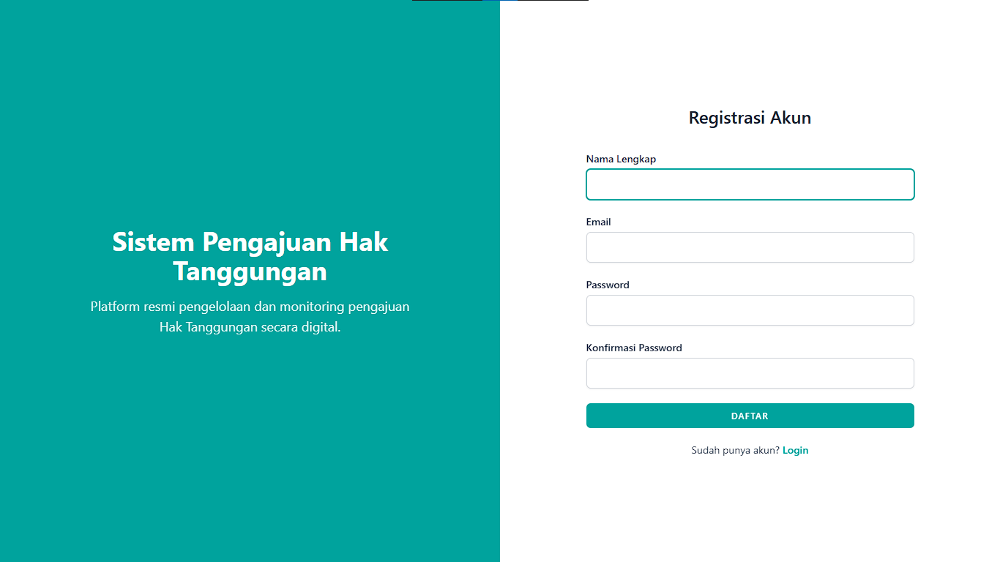
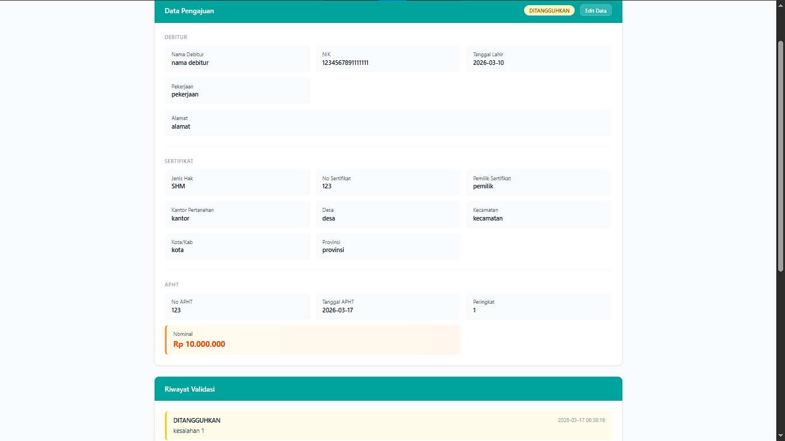
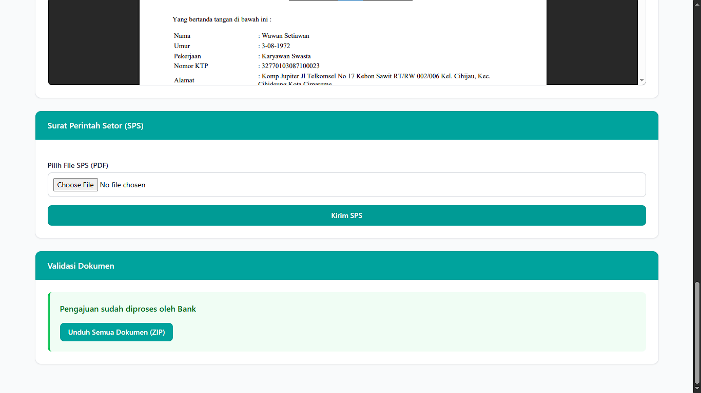
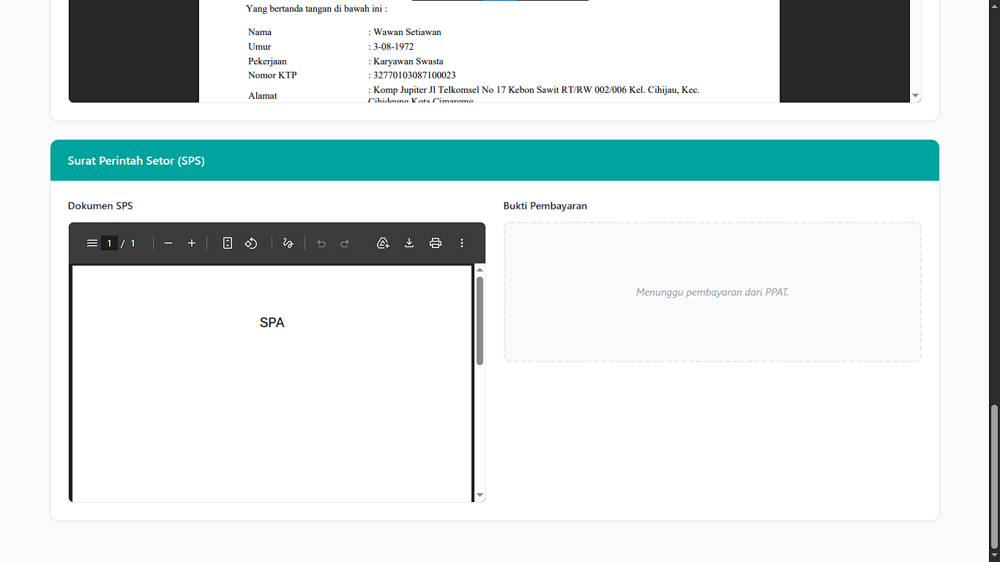
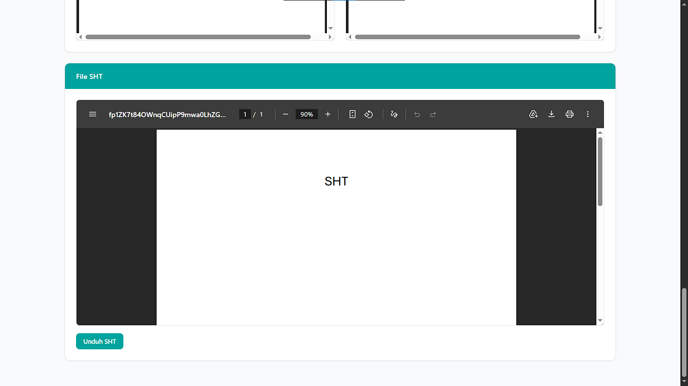
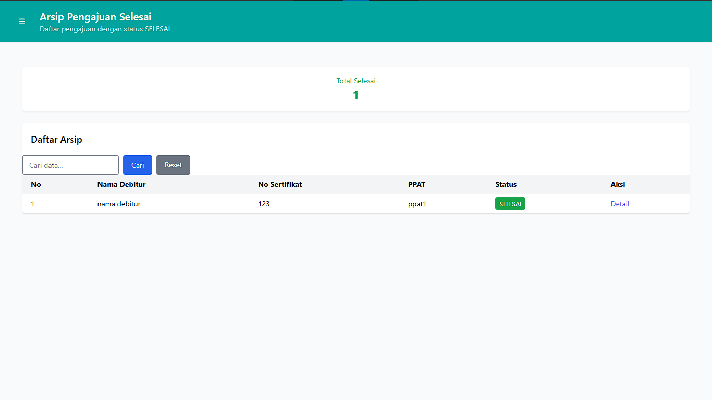
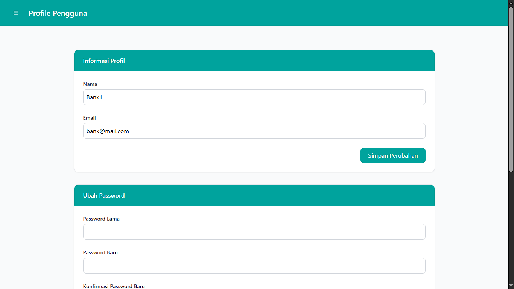
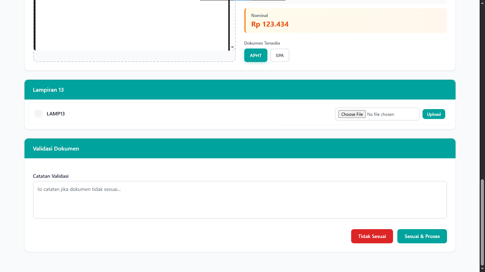

# Sistem Informasi Pengajuan Hak Tanggungan Elektronik (HT-el)

<p align="center">


</p>

---

# Tentang Project

**Sistem Informasi Pengajuan Hak Tanggungan Elektronik (HT-el)** merupakan aplikasi berbasis web yang dikembangkan untuk mempermudah koordinasi antara **Pejabat Pembuat Akta Tanah (PPAT)** dan **Bank** dalam proses pengajuan Hak Tanggungan Elektronik.

Sebelum sistem ini dikembangkan, proses koordinasi dilakukan menggunakan media komunikasi seperti email dan aplikasi pesan instan. Hal tersebut menyebabkan berbagai kendala, di antaranya:

- keterlambatan validasi dokumen,
- kesalahan pertukaran data,
- sulitnya memantau status pengajuan,
- tidak adanya riwayat koordinasi yang terpusat,
- proses revisi dokumen yang kurang efisien.

Melalui aplikasi ini, seluruh proses pengajuan dilakukan dalam satu sistem sehingga komunikasi menjadi lebih cepat, terdokumentasi, dan mudah dipantau secara real-time.

---

# Tujuan

Project ini dikembangkan untuk:

- Mempermudah koordinasi antara PPAT dan Bank.
- Mempercepat proses validasi dokumen.
- Mengurangi kesalahan administrasi.
- Menyediakan monitoring status pengajuan secara real-time.
- Menjadi media penyimpanan arsip digital seluruh pengajuan HT-el.

---

# Role Pengguna

Sistem memiliki dua jenis pengguna.

## 1. PPAT

PPAT bertugas melakukan seluruh proses awal pengajuan Hak Tanggungan.

Hak akses:

- Login
- Dashboard
- Membuat pengajuan
- Upload dokumen
- Edit pengajuan
- Melihat status pengajuan
- Melakukan perbaikan apabila ditangguhkan
- Upload bukti pembayaran
- Download SPS
- Download Sertifikat Hak Tanggungan (SHT)
- Riwayat pengajuan
- Profil

---

## 2. Bank

Bank bertugas melakukan proses validasi dan pengelolaan pengajuan.

Hak akses:

- Login
- Dashboard
- Melihat seluruh pengajuan
- Validasi dokumen
- Memberikan catatan revisi
- Mengubah status pengajuan
- Generate Lampiran 13
- Upload SPS
- Upload Sertifikat Hak Tanggungan
- Riwayat pengajuan
- Kelola akun PPAT
- Profil

---

# Fitur Utama

## Dashboard

- Statistik jumlah pengajuan
- Monitoring status
- Filter data
- Pencarian pengajuan

---

## Pengajuan Hak Tanggungan

PPAT dapat:

- Mengisi data debitur
- Mengisi data sertifikat
- Mengisi data APHT
- Mengunggah seluruh dokumen pendukung

---

## Validasi Dokumen

Bank dapat:

- Melihat detail pengajuan
- Memeriksa seluruh dokumen
- Memberikan catatan kesalahan
- Menyetujui pengajuan
- Menangguhkan pengajuan

---

## Perbaikan Pengajuan

Jika terdapat kesalahan dokumen:

- Bank memberikan catatan revisi.
- PPAT memperbaiki data.
- Pengajuan dikirim kembali tanpa membuat data baru.

---

## Monitoring Status

Setiap perubahan status dapat dipantau oleh kedua belah pihak secara real-time.

---

## Arsip Digital

Seluruh pengajuan tersimpan sebagai arsip digital sehingga mudah dicari kembali.

---

# Workflow Sistem



---

# Status Pengajuan

| Status | Deskripsi |
|---------|-----------|
| Upload | Draft pengajuan |
| Diajukan | Menunggu validasi Bank |
| Ditangguhkan | Perlu revisi |
| Diproses | Sedang diproses oleh Bank |
| Perintah Setor | SPS diterbitkan |
| Dibayar | Bukti pembayaran diterima |
| Terbit SHT | Sertifikat diterbitkan |
| Selesai | Pengajuan selesai |

---

# Dokumen yang Dikelola

Sistem mendukung pengelolaan dokumen berikut.

- APHT
- AKAD
- SPA
- KTP
- Sertifikat
- Lampiran 13
- Surat Perintah Setor (SPS)
- Bukti Pembayaran
- Sertifikat Hak Tanggungan (SHT)

---

# Tech Stack

## Backend

- Laravel 12
- PHP 8.3

## Frontend

- Blade
- Tailwind CSS
- JavaScript

## Database

- MySQL

## Tools

- Composer
- Node.js
- NPM
- Git
- Visual Studio Code
- Figma

---

# Arsitektur

```
PPAT
      │
      ▼
Laravel Application
      │
      ▼
MySQL Database
      ▲
      │
Bank
```

---

# Struktur Folder

```
app/
bootstrap/
config/
database/
public/
resources/
routes/
storage/
tests/
vendor/
```

---

# Instalasi

Clone repository.

```bash
git clone https://github.com/username/htel-system.git
```

Masuk ke project.

```bash
cd htel-system
```

Install dependency.

```bash
composer install

npm install
```

Copy file environment.

```bash
cp .env.example .env
```

Generate application key.

```bash
php artisan key:generate
```

---

# Database

Buat database baru.

```
htel_system
```

Kemudian jalankan migration.

```bash
php artisan migrate
```

Apabila tersedia seeder.

```bash
php artisan db:seed
```

---

# Menjalankan Project

Jalankan server Laravel.

```bash
php artisan serve
```

Jalankan Vite.

```bash
npm run dev
```

Akses melalui browser.

```
http://127.0.0.1:8000
```

---

# Environment

Contoh konfigurasi.

```env
APP_NAME=HTEL
APP_ENV=local
APP_KEY=
APP_DEBUG=true

DB_CONNECTION=mysql
DB_HOST=127.0.0.1
DB_PORT=3306
DB_DATABASE=htel_system
DB_USERNAME=root
DB_PASSWORD=
```

---

# Pengujian

Project telah dilakukan pengujian menggunakan:

- Black Box Testing
- System Usability Scale (SUS)

## Hasil

| Pengujian | Hasil |
|-----------|-------|
| Black Box Testing | Seluruh fungsi berjalan sesuai kebutuhan |
| SUS PPAT | 86.5 |
| SUS Bank | 87.0 |
| Grade | A |
| Acceptability | Acceptable |
| Adjective Rating | Excellent |

---

# Metode Pengembangan

Project dikembangkan menggunakan metode **Rapid Application Development (RAD)**.

Tahapan pengembangan:

1. Requirements Planning
2. User Design
3. Construction
4. Cutover

Pendekatan RAD dipilih karena memungkinkan proses pengembangan dilakukan secara cepat melalui iterasi singkat dan keterlibatan aktif pengguna dalam setiap tahap pengembangan.

---

# Screenshot Aplikasi

Berikut merupakan tampilan utama dari **Sistem Informasi Pengajuan Hak Tanggungan Elektronik (HT-el)**.

---

## Registrasi Akun PPAT

Halaman registrasi digunakan oleh pihak Bank untuk menambahkan akun PPAT yang akan menggunakan sistem.

<p align="center">

</p>

---

## Login

Seluruh pengguna melakukan autentikasi menggunakan username dan password sesuai hak akses masing-masing.

<p align="center">

</p>

---

## Dashboard PPAT

Dashboard utama PPAT yang menampilkan statistik pengajuan serta daftar pengajuan yang sedang diproses.

<p align="center">

</p>

---

## Dashboard Bank

Dashboard Bank untuk memonitor seluruh pengajuan yang masuk dari PPAT.

<p align="center">

</p>

---

## Halaman Pengajuan HT-el

PPAT menginput seluruh data debitur beserta informasi Hak Tanggungan.

<p align="center">

</p>

---

## Upload Dokumen Pengajuan

PPAT mengunggah seluruh dokumen persyaratan pengajuan.

<p align="center">

</p>

---

## Ringkasan Pengajuan

Tahap akhir sebelum pengajuan dikirim ke Bank.

<p align="center">

</p>

---

## Detail Pengajuan

Menampilkan seluruh informasi pengajuan beserta dokumen yang telah diunggah.

<p align="center">

</p>

---

## Detail Dokumen

Menampilkan informasi tambahan mengenai dokumen yang telah diunggah.

<p align="center">

</p>

---

## Pengajuan Ditangguhkan

Jika terdapat kesalahan data atau dokumen, Bank memberikan catatan revisi sehingga PPAT dapat melakukan perbaikan.

<p align="center">

</p>

---

## Edit Data Pengajuan

PPAT dapat memperbaiki data pengajuan tanpa perlu membuat pengajuan baru.

<p align="center">

</p>

---

## Validasi Pengajuan (Bagian Atas)

Bank melakukan pemeriksaan data dan dokumen yang dikirimkan oleh PPAT.

<p align="center">

</p>

---

## Validasi Pengajuan (Bagian Bawah)

Bank menentukan status pengajuan serta memberikan catatan apabila diperlukan.

<p align="center">

</p>

---

## Status Diproses

Pengajuan telah lolos validasi dan sedang diproses oleh pihak Bank.

<p align="center">

</p>

---

## Surat Perintah Setor (Bank)

Bank mengunggah Surat Perintah Setor (SPS) ke dalam sistem.

<p align="center">

</p>

---

## Surat Perintah Setor (PPAT)

PPAT mengunduh SPS sebagai dasar melakukan pembayaran.

<p align="center">

</p>

---

## Konfirmasi Pembayaran

Setelah pembayaran dilakukan, bukti pembayaran diunggah ke dalam sistem.

<p align="center">

</p>

---

## Sertifikat Hak Tanggungan (Bank)

Bank mengunggah Sertifikat Hak Tanggungan Elektronik yang telah diterbitkan.

<p align="center">

</p>

---

## Sertifikat Hak Tanggungan (PPAT)

PPAT dapat mengunduh Sertifikat Hak Tanggungan yang telah diterbitkan.

<p align="center">

</p>

---

## Arsip Pengajuan

Seluruh pengajuan yang telah selesai maupun yang masih berjalan tersimpan dalam arsip digital.

<p align="center">

</p>

---

## Kelola Akun PPAT

Bank dapat melihat dan mengelola akun PPAT yang terdaftar pada sistem.

<p align="center">

</p>

---

## Tambah Akun PPAT

Halaman untuk menambahkan akun PPAT baru.

<p align="center">

</p>

---

## Profil Pengguna

Halaman yang menampilkan informasi akun pengguna serta pengaturan profil.

<p align="center">

</p>

---

## Iterasi Pengembangan

Perbandingan tampilan sebelum dan sesudah proses iterasi berdasarkan masukan pengguna pada metode Rapid Application Development (RAD).

<p align="center">

</p>

---

# Future Development

Beberapa pengembangan yang dapat dilakukan pada versi selanjutnya.

- Integrasi API ATR/BPN
- Notifikasi Email
- Notifikasi WhatsApp
- Dashboard Analytics
- Multi Bank
- Multi PPAT
- Audit Log
- Digital Signature
- Export Excel
- REST API
- Mobile Application

---

# Author

**Raka Zeniusa Barron**

Teknik Informatika

Universitas Muhammadiyah Bandung

2026

---

# License

Project ini dikembangkan sebagai **Academic Project** dalam penyusunan skripsi Program Studi Teknik Informatika Universitas Muhammadiyah Bandung.

Repository ini juga dirancang agar dapat digunakan sebagai referensi pengembangan sistem informasi koordinasi pengajuan Hak Tanggungan Elektronik di lingkungan PPAT dan Bank.

MIT License